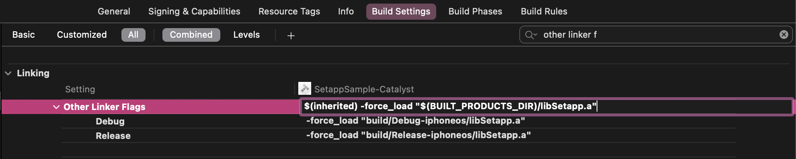
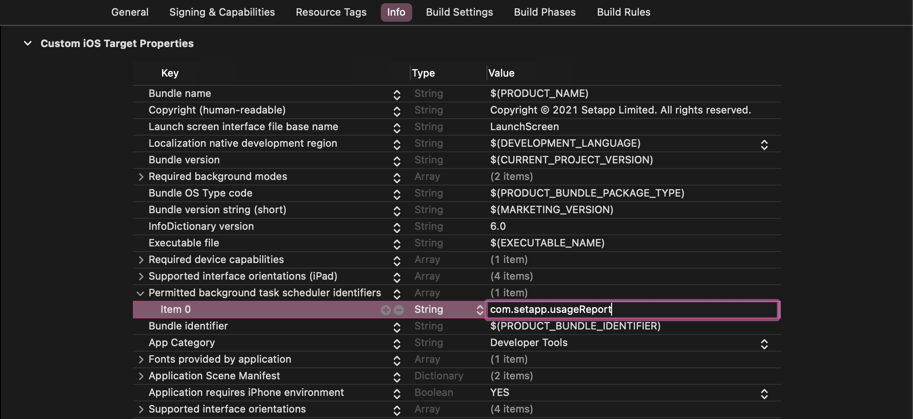
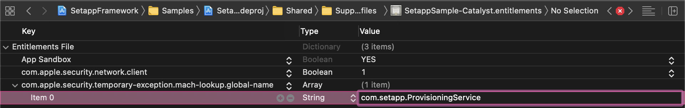
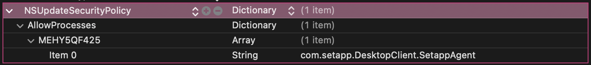

# Setapp Framework

## Contents

1. [Integration requirements](#integration-requirements)
1. [Install and set up Framework](#install-and-set-up-framework)
    * [Installing the Framework](#installing-the-framework)
    * [Setting up the Framework](#setting-up-the-framework)
1. [iOS](#ios-1)
    * [Add a public key to your app](#add-a-public-key-to-your-app)
    * [Initialize the Framework](#initialize-the-framework)
    * [Add custom URL scheme support to your application target](#add-custom-url-scheme-support-to-your-application-target)
    * [Monitor subscription status](#monitor-subscription-status)
    * [Configure background tasks](#configure-background-tasks)
1. [macOS](#macos-1)
    * [Set an app bundle ID](#set-an-app-bundle-id) 
    * [Add sandbox temporary exception entitlement](#add-sandbox-temporary-exception-entitlement)
    * [Add a public key to your app](#add-a-public-key-to-your-app-1)
    * [Allow Setapp to update your app on macOS 13+](#allow-setapp-to-update-your-app-on-macos-13)
    * [Implement the release notes (What's New) functionality](#implement-the-release-notes-whats-new-functionality)
    * [Add an email subscription form](#add-an-email-subscription-form)
1. [Use the Vendor API to integrate apps into Setapp](#use-the-vendor-api-to-integrate-apps-into-setapp)
1. [Logging](#logging)
1. [Testing your app](#testing-your-app)
1. [Setapp Framework wrappers](#setapp-framework-wrappers)
    * [Electron](#electron)
1. [Integrations samples](#integration-samples)

# Integration requirements

### iOS

* The Setapp iOS Framework can be integrated into apps developed with iOS 10.0 or later. 
The Framework doesn’t work with the watchOS and the tvOS yet.

* The supported Swift version for the iOS Framework is 5.2 or later.

* An iOS app must support custom URL schemes. The URL scheme must be the same as the app bundle ID.
    Related documentation by Apple: [Defining a Custom URL Scheme for Your App](https://developer.apple.com/documentation/uikit/inter-process_communication/allowing_apps_and_websites_to_link_to_your_content/defining_a_custom_url_scheme_for_your_app).

### macOS
* The applications must be signed with a Developer ID certificate.
* Compatibility with the latest macOS version must be tested and confirmed.

    We don’t have strict requirements for supporting macOS versions. Setapp supports macOS versions from 10.15 (Catalina) to 12.0 (Monterey). However, we have a frozen version for our customers who use older macOS 10.13 (High Sierra) - 10.14 (Mojave) versions. So, if your app can support some of the older macOS versions - your revenue could increase.

**Not allowed functionality of macOS apps:**
* Paid features or app components;
* Proprietary installer and update frameworks;
* Activation and licensing mechanisms;
* Built-in stores and in-app purchases.

# Install and set up Framework

## Installing the Framework

### Swift Package Manager

Linking the Framework with your project using the [Swift Package Manager](https://swift.org/package-manager/) requires Xcode 12 or later.

Add the following dependency in your `Package.swift`:

```swift
dependencies: [
  .package(
    name: "Setapp",
    url: "https://github.com/MacPaw/Setapp-framework.git",
    from: "2.0.1")
]
```

### CocoaPods

With [CocoaPods](https://cocoapods.org/), add the following string to your `Podfile`:

```ruby
pod 'Setapp'
```

To support usage of the Simulator on Macs with Apple Silicon, we've changed the source binary format from the universal binary (fat) framework to XCFramework. To work with the latest Framework format, you need CocoaPods version 1.9 or later and Xcode version 11.0 or later.

### Manual installation

First step is to get Setapp Framework.

To add the Framework by using [Git Submodules](https://git-scm.com/book/en/v2/Git-Tools-Submodules), execute the following Git command in your project's root directory:

```shell
git submodule add https://github.com/MacPaw/Setapp-framework.git
```

The Setapp Framework files are located in the `Setapp-framework` folder of the project directory.

Second step is to add the Framework to your project.

Now you have 2 options: Install as package or Install as xcframework. The difference is that package will correctly understand Setapp package type, and with xcframework 

#### Option 1. Add Setapp framework as package

> As alternative to the first step with git submodules, you can also download and add the Framework manually by doing these steps:
> * Download the `Source code (zip)` file from Assets on our [latest release page][github-release]. 
> * Rename versioned folder `Setapp-framewrok-*` to `Setapp-framework`.
> * Extract files from the archive and copy the unpacked `Setapp-framework` to your project directory.

1. Open your project in XCode.
1. Drag & Drop the whole `Setapp-framework` folder to your project.
1. Select your app target.
1. Choose General tab.
1. Press `+` in the Frameworks, Libraries, and Embedded Content section.
1. Choose `Setapp` library in `Workspace`/`Setapp` group.

#### Option 2. Install as xcframework

> As alternative to the first step with git submodules, you can also download and add the Framework manually by doing these steps:
> * Download the Framework here: [Setapp.xcframework.zip][github-release-xcframework].
> * Extract the bundle from the archive and copy the unpacked `Setapp-framework` to your project directory.
> * (iOS only) Download the iOS resources bundle here: [SetappFramework-Resources-iOS.bundle.zip][github-release-ios-resources].

Add the Framework to your project.

1. Open your project in XCode.
1. Select your app target.
1. Click the General settings pane.
1. Drag `Setapp.xcframework` to the Frameworks, Libraries, and Embedded Content section. 
1. Choose the `Do Not Embed` option from the menu in the `Embed` column.
1. (iOS only) Extract the iOS resource bundle from the archive and copy the unpacked `SetappFramework-Resources-iOS.bundle` to your project directory, drag it to your Xcode project and make sure that it's `Target membership` is your application target.

For more detailed information, see ["Link a target to frameworks and libraries"](https://help.apple.com/xcode/mac/current/#/dev51a648b07) in the Xcode Help.

### Carthage
To use [Carthage](https://github.com/Carthage/Carthage), specify the line below in your `Cartfile`:

```
github "MacPaw/Setapp-framework"
```

## Setting up the Framework

### Link framework to your app

> ℹ️ If you are using CocoaPods - you can skip this step.

Link `libSetapp.a` to the application target. Go to the `Build Settings` tab of your project and add the following value string to `Other Linker Flags` (`OTHER_LDFLAGS`):

If you are using Swift Package Manager, integrating Framework manually, or using Carthage:

  ```
    -force_load "$(BUILT_PRODUCTS_DIR)/libSetapp.a"
  ```



> ⚠️ You must strictly follow the provided instructions to make your application function correctly within the Setapp environment.

# iOS

## Add a public key to your app

To establish trust between your app and our service, the Framework needs a public key that is unique for every app. 

### Register an iOS app in the Setapp developer account and generate a public key

1. Go to the [Apps page](https://developer.setapp.com/applications) of your developer account and click "Add iOS application" below the companion macOS app.

2. Enter the URL of your iOS app on the App Store, then click Generate.

Once the Setapp system processed the link, your app becomes registered, and the Setapp public key is generated for you. To download the key, click the link that appears below the field with the URL.

You won't need to specify the App Store URL again when submitting the app for review with Setapp — the info is stored in the Setapp system.

### Add a public key to your project as a resource

A public key is used to operate with the data received from the Setapp system. The public key is unique for every app in the Setapp suite and it is an essential part of the Framework's security.

To add the public key to your project in Xcode, simply drag the `setappPublicKey.pem` key file to the navigator area. A new dialog box appears. Select the "Copy items if needed" checkbox on the top of the dialog box.

> ⚠️ Please note that public keys for iOS & macOS platforms differ.

## Initialize the Framework

Once you've added the public key, you should tell our Framework its location. By default, we assume that the public key file is named `setappPublicKey.pem` and located in the app's main bundle.

### Start

The `start(with:)` method of the `SetappManager` class is responsible for these initialization operations:
- Providing configuration for the Framework so that it starts for your app;
- Starting reporting the app usage once it is successfully activated for a Setapp user.

If you have the `UIApplicationDelegate` method in your app, add the following code to the `application(_:, didFinishLaunchingWithOptions:)` function:

```swift
import Setapp

class AppDelegate: UIResponder, UIApplicationDelegate {
  
  func application(
    _ application: UIApplication,
    didFinishLaunchingWithOptions launchOptions: [UIApplication.LaunchOptionsKey: Any]?
  ) 
  -> Bool
  {
    SetappManager.shared.start(with: .default)
    return true
  }

}
```

If you have `UIWindowSceneDelegate` in your app, add the code below to the `scene(_:, willConnectTo:, options:)` function:

```swift
import Setapp

class SceneDelegate: UIResponder, UIWindowSceneDelegate {
  
  func scene(
    _ scene: UIScene,
    willConnectTo session: UISceneSession,
    options connectionOptions: UIScene.ConnectionOptions
  )
  {
    SetappManager.shared.start(with: .default)
  }

}
```

### Provide custom configuration

You’ll need to provide a custom configuration for the `SetappManager` class in the following cases:

- You’re not using the main app bundle to store the public key.
- You have renamed the public key file in your project.

Providing configuration must take place while initializing the Framework.

```swift
let configuration = SetappConfiguration(
  publicKeyBundle: .main,
  publicKeyFilename: "setappPublicKey.pem"
)

SetappManager.shared.start(with: configuration)
```

## Add custom URL scheme support to your application target

As already mentioned in [Integration requirements](#requirements-for-integrating-the-framework), we use custom URL schemes to unlock the restricted functionality of your app for Setapp users. To add a URL scheme, follow these steps:

1. In Xcode, go to the Info tab of your target settings.
1. Expand the URL Types section.
1. Add a new URL Type with the following parameters:
    * Identifier: `Setapp`  
    * URL Schemes: your bundle identifier
    * Role: `None`


### Handle requests to open URL

Once the URL scheme setup is complete, you can proceed with adding the necessary code to handle the process of opening URLs in your app.

If you have `UIApplicationDelegate` in your app, add the following code to the `application(_:, open:, options:)` function:

```swift
import Setapp

class AppDelegate: UIResponder, UIApplicationDelegate {

  func application(
    _ app: UIApplication,
    open url: URL,
    options: [UIApplication.OpenURLOptionsKey: Any] = [:]
  ) 
  -> Bool
  {
    if SetappManager.shared.canOpen(url: url) {
      return SetappManager.shared.open(url: url, options: options) { result in
        switch result {
        case let .success(setappSubscription):
          print("Successfully unlocked new features!")
          print("Setapp subscription:", setappSubscription)
        case let .failure(error):
          print("Failed to unlock new app features due to the error:", error)
        }
      }
    }
    return false
  }

}
```

If you have `UIWindowSceneDelegate` in your app, add the following code to these functions:

* `scene(_:, willConnectTo:, options:)`
* `scene(_:, openURLContexts:)`

```swift
import Setapp

class SceneDelegate: UIResponder, UIWindowSceneDelegate {
  
  func scene(
    _ scene: UIScene,
    willConnectTo session: UISceneSession,
    options connectionOptions: UIScene.ConnectionOptions
  )
  {
    SetappManager.shared.start(with: .default)
    if SetappManager.shared.canOpen(urlContexts: connectionOptions.urlContexts) {
      SetappManager.shared.open(urlContexts: connectionOptions.urlContexts) { result in
        switch result {
        case let .success(setappSubscription):
          print("Successfully unlocked new features!")
          print("Setapp subscription:", setappSubscription)
        case let .failure(error):
          print("Failed to unlock new app features due to the error:", error)
        }
      }
    }
  }

  func scene(
    _ scene: UIScene,
    openURLContexts URLContexts: Set<UIOpenURLContext>
  )
  {
    if SetappManager.shared.canOpen(urlContexts: URLContexts) {
      SetappManager.shared.open(urlContexts: URLContexts) { result in
        switch result {
        case let .success(setappSubscription):
          print("Successfully unlocked new features!")
          print("Setapp subscription:", setappSubscription)
        case let .failure(error):
          print("Failed to unlock new app features due to the error:", error)
        }
      }
    }
  }

}
```

### Display activation result

Framework displays activation alerts automatically. However, if you want to customize this behavior, you can conform `SetappMessagesPresenterProtocol` by your presenter object and provide it to the framework using the `.setMessagesPresenter(_:)` method of the `shared` instance of the `SetappManager` class
 

```swift

final class CustomMessagesPresenter: SetappMessagesPresenterProtocol {

    

    func present(_ statusMessage: SetappStatusMessage,

                 options: SetappStatusMessageOptions?) {

        switch statusMessage {

        case .activationInProgress:

            // handle activationInProgress status

        case .activationSuccess:

            // handle activationSuccess status

        case .error(let setappError):

            // handle error, you can switch setappError.errorCode

            // for more detailed info

        }

    }

}

```

## Monitor subscription status

You can monitor the subscription status for the Setapp member who uses your app with the help of the `SetappSubscription` object. 3 monitoring options are available for you: `SetappManager` delegate, notifications, and the Key-Value Observation (KVO).

### Delegate

Simply declare a class conforming to the `SetappManagerDelegate` protocol and set up a `delegate` property for the `shared` instance of the `SetappManager` class.

```swift
import Setapp
class SetappSubscriptionManagerDelegate: SetappManagerDelegate {
  init() {
    SetappManager.shared.delegate = self
  }
  // MARK: SetappManagerDelegate
  func setappManager(
    _ manager: SetappManager,
    didUpdateSubscriptionTo newSetappSubscription: SetappSubscription
  )
  {
    print("Manager:", manager)
    print("Setapp subscription:", newSetappSubscription)
  }
}
```

### Notification

In addition to the delegate method, you can observe the `SetappManager.didChangeSubscriptionNotification` notification for the `shared` instance of the `SetappManager` object. As you can see from the example below, the manager is the object, and a new Setapp subscription state is located in the `NSKeyValueChangeKey.newKey` key in the `userInfo` property of the notification.

```swift
import Setapp
class SetappSubscriptionNotificationObserver {
  private var notificationObserver: NSObjectProtocol?
  init() {
    notificationObserver = NotificationCenter.default
      .addObserver(forName: SetappManager.didChangeSubscriptionNotification,
                   object: SetappManager.shared,
                   queue: .none) { [weak self] (notification) in
                    self?.setappSubscriptionDidChange(notification: notification)
    }
  }
  deinit {
    notificationObserver.map(NotificationCenter.default.removeObserver(_:))
  }
  // MARK: Notification
  func setappSubscriptionDidChange(notification: Notification) {
    guard
      let manager = notification.object as? SetappManager,
      let newValue = notification.userInfo?[NSKeyValueChangeKey.newKey],
      let newSetappSubscription = newValue as? SetappSubscription else {
        return
    }
    print("Manager:", manager)
    print("Setapp subscription:", newSetappSubscription)
  }
}
```

### Key-Value Observation (KVO)

If you prefer KVO, you can observe the `subscription` property of the `shared` instance of the  `SetappManager` class.

```swift
import Setapp
class SetappSubscriptionKVOObserver {
  private var kvoObserver: NSObjectProtocol?
  init() {
    kvoObserver = SetappManager.shared
      .observe(\.subscription, options: [.new]) { [weak self] (manager, change) in
        self?.setappSubscriptionDidChange(manager: manager, change: change)
    }
  }
  // MARK: KVO observation
  func setappSubscriptionDidChange(
    manager: SetappManager,
    change: NSKeyValueObservedChange<SetappSubscription>
  )
  {
    guard let newSetappSubscription = change.newValue else {
      return
    }
    print("Manager:", manager)
    print("Setapp subscription:", newSetappSubscription)
  }
}
```

## Configure background tasks

We utilize background tasks to send you a usage report when a user doesn't use your application at the moment. This allows us to ensure that usage tracking is delivered to our servers.

To send network requests with usage reports in the background, you must select the `Background fetch` checkbox in the `Background modes` capability group.

1. Go to the Signing & Capabilities tab.
1. Add `Background modes` capability.
1. Select `Background fetch` mode.
1. Select `Background processing` mode.


Add the following code to your `UIApplicationDelegate` class:
```swift
func application(
  _ application: UIApplication,
  handleEventsForBackgroundURLSession identifier: String,
  completionHandler: @escaping () -> Void
)
{
  if SetappManager.isSetappBackgroundSessionIdentifier(identifier) {
    SetappManager.shared.backgroundSessionCompletionHandler = completionHandler
  }
}
```

### Permitted background task identifiers
For iOS 13 and later, we also utilize background tasks. That means that you must allow Setapp to run background tasks with specific identifiers. To do that:

1. Open your `Info.plist` file.
1. Add the `Permitted background task scheduler identifiers` (`BGTaskSchedulerPermittedIdentifiers`) key to the dictionary.
1. Append `com.setapp.usageReport` to the key values array.




# macOS

### Set an app bundle ID

The bundle ID of your app for Setapp must use the `-setapp` suffix to follow this pattern:
```
<domain>.<companyName>.<appName>-setapp
```

For example:
```
com.macpaw.CleanMyMac-setapp
app.macpaw.Gemini-setapp
```

If your app has additional executables, their bundle IDs must conform to the following pattern:
```
<domain>.<companyName>.<appName>-setapp.<executableName>
```

For example:
```
com.macpaw.CleanMyMac-setapp.Menu
```

To add the bundle ID, follow these steps: 
1. Go to the [Apps page](https://developer.setapp.com/applications) in your developer account. You'll see that your app is already there. Click `Add First Version.`
1. Enter the bundle ID of your app in the dialog box that appeared.

It is critical to use the same bundle ID in the Xcode target of your app and in your developer account. Update your app's target if it needed.

> ⚠️ You will not be able to change the bundle ID once you set it.

> 📘 A bundle ID is a unique case-sensitive identifier that contains only alphanumeric characters (A-Z, a-z, 0-9), period (.), and hyphen (-). Please note that only the hyphen-minus sign (U+002D) can be used (don't press the Option key). Also, note that you mustn't specify an app version in the bundle ID.  

> 📘 The string must be written in reverse-DNS format. Example: Your domain is mycompany.com, and your app's name is MyApp. In this case, you can use `com.mycompany.myapp-setapp` as a bundle ID of your app.


## Add sandbox temporary exception entitlement

If your app is sandboxed, you must add a temporary exception to enable communication between the Library integrated into your app and Setapp Mach services.

1. Open the entitlements file of your project.
1. Add `com.apple.security.temporary-exception.mach-lookup.global-name` entitlement key.
1. Add the `com.setapp.ProvisioningService` string (the Setapp service name) value for the `com.apple.security.temporary-exception.mach-lookup.global-name` entitlement key’s value array.

As a result, your entitlements file must look similar to the following:



## Add a public key to your app

To establish trust between your app and our service, the Frameworks needs a public key that is unique for every app. 

### Register the macOS app in the Setapp developer account and generate a public key

1. Go to the [Apps page](https://developer.setapp.com/applications) of your developer account and click `New version` on your app.
1. On the right side of `Release info`, you can find a notion `For macOS library 2.0.0 and higher, find a public key here.`.
1. Click the link and download the public key.

### Add the public key to your project as a resource

The public key is used to operate with the data received from the Setapp system. The public key is unique for every app in the Setapp suite and it is an essential part of the Framework's security.

To add a public key to your project in Xcode, simply drag the `setappPublicKey.pem` key file to the navigator area. A new dialog box appears. Select the "Copy items if needed" checkbox on the top of the dialog box.

> ⚠️ For macOS applications, you can only use this public key filename: (`setappPublicKey.pem`). 

> ⚠️ Public key must be located in the main application bundle.

> ⚠️ Please note that public keys for iOS & macOS platforms differ.


## Allow Setapp to update your app on macOS 13+

To allow Setapp to update your app on macOS 13 (Ventura) and higher, please add the following to your apps Info.plist file:

```xml
  <key>NSUpdateSecurityPolicy</key>
  <dict>
    <key>AllowProcesses</key>
    <dict>
      <key>MEHY5QF425</key>
      <array>
        <string>com.setapp.DesktopClient.SetappAgent</string>
      </array>
    </dict>
  </dict>
```



## Implement the release notes (What's New) functionality

We highly recommend implementing the release notes functionality into your app to improve the user experience. However, the final dicision is up to you.

### Display release notes automatically
Show a dialog box with a list of changes in the updated app version automatically.

Call the `showReleaseNotesWindowIfNeeded()` function of the shared `SetappManager` in the `applicationDidFinishLaunching(_:)` method (or add it to another appropriate place, for example, after the onboarding dialog of your app). Note that this function reveals a dialog only after opening a newly updated app.

```swift
func applicationDidFinishLaunching(_ aNotification: Notification) {
  SetappManager.shared.showReleaseNotesWindowIfNeeded()
}
```

### Show release notes on request
To allow users to view release notes anytime they want, add a corresponding option to the app's main menu. Then call the `showReleaseNotesWindow()` function of the shared `SetappManager`.

```swift
@IBAction private func showReleaseNotes(_ sender: Any) {
  SetappManager.shared.showReleaseNotesWindow()
}
```

## Add an email subscription form

As a developer, you might want to stay in touch with your users on Setapp. We understand this intention and we can provide you with a list of their contacts if users will consent. But first, you need to implement a User Permissions API for asking a user to share their email address. Thus, you can create a permission-based email list of your active users. Later, you can download it directly from your [Developer Account](https://developer.setapp.com/statistics/users-emails). 

To show a dialog box for asking users to share their email with the current application, call the `askUserToShareEmail()` function of the shared `SetappManager`.

```swift
@IBAction private func showReleaseNotes(_ sender: Any) {
  SetappManager.shared.askUserToShareEmail()
}
```

When a user made a choice, you cannot ask him/her again to change the decision. 

However, if the user closes the dialog box without making a choice, Setapp will show the dialog box again: 
* 2nd time - in 1 day
* 3rd time - in 2 days
* 4th time - in 3 days
* 5-7th times - in 7 days
* 8th time and further - in 30 days

> ℹ️ The User Permissions API requires Setapp application version 3.2.1 or newer. If a user uses an older Setapp version, the email subscription form will not appear.


# Use the Vendor API to integrate apps into Setapp

> ⚠️ Integrating apps into Setapp using the Vendor API is the next "big thing" we're actively working on. Most features are still under development, **so please don't use them in Production yet**.\
> Still, we'd like to share the main ideas in order to get your feedback at this early stage. We're looking forward to your comments at developer@setapp.com or in the Setapp Community Slack.

## Request authorization code to access the Setapp server

To start communicating with Setapp's server, you must request an authorization (auth) code from it. The auth code has a 20-minute lifetime, so you must pass the auth code to your server for further processing during this time. 

How the communication between your app/server and the Setapp system via the Vendor API works:

* Your app requests and receives an auth code from the Setapp server.
* Your app passes the auth code to your server.
* Your server exchanges the auth code for the Vendor API's access token and refresh token.
* Your server uses the obtained tokens for further communication with Setapp using the API (exchanging subscription info, usage reporting, etc.).

You can get the auth code using the `requestAuthorizationCode` function. The function requires an internet connection and fails with a corresponding error if a user's iOS or MacOS device was offline.

To request the auth code, you must specify these parameters:
  - `clientID`: the app's client ID generated in your developer account. If you have several apps in Setapp, the `clientID` must be different for them (including macOS apps and their iOS companions).
  - `scope`: a list of functionalities you wish to authorize for communication with the Setapp system. In Swift, the possible values are listed in the `VendorAuthorizationScope` enum. In Objective-C, however, you’ll have to specify the values yourself as `NSStrings`.
    > The other possible functionalities scope values are mentioned in the [GET /authorize](https://docs.setapp.com/reference#get_authorize) method of the Vendor API.

```swift
// Make sure an active Setapp subscription is present.
// See subscription monitoring examples on this page for more info.
SetappManager.shared.requestAuthorizationCode(
  clientID: "your_vendor_api_authorization_code",
  scope: [.applicationAccess]
) { result in
  switch result {
  case let .success(code):
    // Authentication code obtained successfully.
    // Use the code to authorize your app or server for Setapp: exchange the auth code for the access token and the refresh token using the Setapp API.
    print(code)
  case let .failure(error):
    // The request has failed.
    // See the error message for details.
    print(error)
  }
}
```


# Logging

If you want to extend or reduce your logs or override the console logs path with your own destination, it's easy to do so with just a few lines of code.

#### Log level
You can easily change your log depth just by setting the `logLevel` property of the `SetappManager` class to one of the standard options:

* `.verbose` 
* `.debug` 
* `.info` (default log level) 
* `.warning`
* `.error`
* `.off`

```swift
SetappManager.logLevel = .debug
```

### Logging override

To override the Setapp’s log destination with your own logger, use the `setLogHandle` method of the ` SetappManager` class. This function takes a closure that accepts the message string and the SetappLogLevel parameter.

```swift
SetappManager.setLogHandle { (message: String, logLevel: SetappLogLevel) in
  print("[\(logLevel)]", message)
}
```

### Viewing logs in Console

To display the Framework logs in the Console app, follow these steps:  

1. Open the app and paste the following query into the Search field:
    ```
    subsystem:com.setapp.fmwk
    ```

1. Make sure these items have been selected in the Actions menu:
    * Include Info Messages
    * Include Debug Messages

Alternatively, you can allow showing debug & info messages from the Setapp Framework by executing this command in Terminal:

```sh
sudo log config --subsystem com.setapp.fmwk --mode "level:debug"
```

## Testing your app

See ["Testing your apps"][doc-testing-your-application] for details.

## Setapp Framework wrappers

### Electron

You can find documentation about integrating Setapp Framework to your Electron app in the [docs/Electron.md](./docs/Electron.md).

## Integration samples

You can find integration samples in the [Samples folder](./Samples).
There are:
* `SetappSample-Catalyst` with manually integrated Setapp Framework.
* `SetappSample-macOS-ObjectiveC` that uses CocoaPods as a dependency manager for Setapp Framework integration.
* `Electron` apps that utilize our node.js wrapper to integrate Setapp Framework into the Electron app.

---
For more details, you can visit ["Integrating the iOS Framework"](https://docs.setapp.com/docs/integrating-the-ios-framework) in Setapp Developer Documentation.

[github-release]: https://github.com/MacPaw/Setapp-framework/releases/latest
[github-release-xcframework]: https://github.com/MacPaw/Setapp-framework/releases/latest/download/Setapp.xcframework.zip
[github-release-ios-resources]:
https://github.com/MacPaw/Setapp-framework/releases/latest/download/SetappFramework-Resources-iOS.bundle.zip
[github-release-QRCodeGenerator]: https://github.com/MacPaw/Setapp-framework/releases/latest/download/Setapp.QRCodeGenerator.zip
[doc-setapp-for-ios-overview-requirements]: https://docs.setapp.com/docs/setapp-for-ios-overview#requirements-for-members-and-developers
[doc-setapp-for-ios-overview-monetization]: ttps://docs.setapp.com/docs/setapp-for-ios-overview#ios-apps-monetization-for-setapp-developers
[doc-testing-your-application]: https://docs.setapp.com/docs/testing-your-application
[doc-updating-applications-auto-updates-for-ios-apps]: https://docs.setapp.com/docs/updating-applications#auto-updates-for-ios-apps
