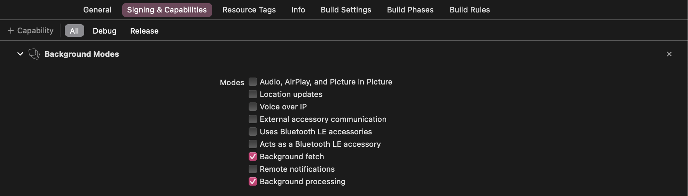

# Setapp Framework 2.0.0 (beta)
​
## Contents
1. [Requirements for integrating the Framework](#requirements-for-integrating-the-framework)
    * [iOS](#ios)
    * [macOS, Catalyst](#macos-catalyst)
1. [Installing the framework](#installing-the-framework)
    * [Swift Package Manager](#swift-package-manager)
    * [CocoaPods](#cocoapods)
    * [Manual installation](#manual-installation)
    * [Carthage](#carthage)
1. [Setting up the Framework](#setting-up-the-framework)
    * [iOS](#ios-1)
        - [Link framework to your app](#link-framework-to-your-app)
        - [Register iOS app in Setapp developer account and generate a public key
](#register-ios-app-in-setapp-developer-account-and-generate-a-public-key)
        - [Add the public key to your project as a resource](#add-the-public-key-to-your-project-as-a-resource)
        - [Initialize the Framework](#initialize-the-framework)
            + [Provide custom configuration](#provide-custom-configuration-optional)
        - [Add custom URL scheme support to your application target](#add-custom-url-scheme-support-to-your-application-target)
        - [Handle requests to open URL](#handle-requests-to-open-url)
        - [Configure background tasks](#configure-background-tasks)
            - [Permitted background task identifiers](#permitted-background-task-identifiers)
    * [macOS, Catalyst](#macos-catalyst-1)
        - [Link framework to your app](#link-framework-to-your-app-1)
        - [Add the public key to your project as a resource](#add-the-public-key-to-your-project-as-a-resource-1)
        - [Add sandbox temporary exception entitlement](#add-sandbox-temporary-exception-entitlement)
1. [Using the Framework](#using-the-framework)
    * [iOS](#ios-2)
        - [Display activation result](#display-activation-result)
        - [Monitor subscription status](#monitor-subscription-status)
            + [Delegate](#delegate)
            + [Notification](#notification)
            + [Key-Value Observation](#key-value-observation-kvo)
    * [iOS, macOS, Catalyst](#ios-macos-catalyst)
        - [Using Vendor API to integrate apps into Setapp (Developer Preview)](#using-vendor-api-to-integrate-apps-into-setapp-developer-preview)
            + [Request authorization code to access the Setapp server](#request-authorization-code-to-access-the-setapp-server) 
        - [Logging](#logging)
            + [Log level](#log-level)
            + [Logging override](#logging-override)
        - [Viewing logs in Console](#viewing-logs-in-console)
1. [Testing your app](#testing-your--app)


## Requirements for integrating the Framework

### iOS

* The Setapp iOS Framework can be integrated into apps developed with iOS 10.0 and later. 
The Framework doesn’t yet work with the watchOS and the tvOS.

* The supported Swift version for the iOS Framework is 5.2 and later.

* The iOS app must support custom URL schemes. The URL scheme must be the same as the app bundle ID.
    Related documentation by Apple: [Defining a Custom URL Scheme for Your App](https://developer.apple.com/documentation/uikit/inter-process_communication/allowing_apps_and_websites_to_link_to_your_content/defining_a_custom_url_scheme_for_your_app).

### macOS, Catalyst
* The applications must be signed with a Developer ID certificate.
* Compatibility with the latest macOS version must be tested and confirmed.\

    We don’t have strict requirements for supporting macOS versions from 10.11 (El Capitan) to 11.0 (Big Sur). However, if Setapp members can use your app on older OS editions (Setapp runs on 10.11 and later), your revenue could increase.

**Not allowed functionality of macOS apps**:
* Paid features or app components;
* Proprietary installer and update frameworks;
* Activation and licensing mechanisms;
* Built-in stores and in-app purchases.

## Installing the Framework

### Swift Package Manager

Linking the Framework with your project using the [Swift Package Manager](https://swift.org/package-manager/) requires Xcode 12 or later.

Add the following dependency in your `Package.swift`:

```swift
dependencies: [
  .package(name: "Setapp",
           url: "https://github.com/MacPaw/Setapp-framework.git",
           .branch("catalyst"))
]
```

### CocoaPods

With [CocoaPods](https://cocoapods.org/), add the following string in your `Podfile`:

```ruby
pod 'Setapp', :git => 'https://github.com/MacPaw/Setapp-framework.git', :branch => 'catalyst'
```

To support the use of the Simulator on Macs with Apple Silicon, we've changed the source binary format from the universal binary (fat) framework to XCFramework. To work with the latest Framework format, you need CocoaPods version 1.9 or later and Xcode version 11.0 or later.

### Manual installation

Step I: Get `Setapp.xcframework` and add it to your project directory.

With [Git Submodules](https://git-scm.com/book/en/v2/Git-Tools-Submodules), add the Framework by executing this Git command in your project's root directory:

```shell
git submodule add https://github.com/MacPaw/Setapp-framework.git
```

The `Setapp.xcframework` bundle is located in the `Setapp-framework` folder of the project directory.

You can also download and add the Framework manually with these steps:

* Download the Framework directly: [Setapp.xcframework.zip][github-release-xcframework].
* Extract the bundle from the archive and copy the unpacked `Setapp.xcframework` to your project directory.

Step II: Add the Framework to your project.

1. Open your project in XCode and select your app target.
1. Click the General settings pane.
1. Drag `Setapp.xcframework` to the Frameworks, Libraries, and Embedded Content section. 
1. Choose the Embed and Sign option from the menu in the Embed column.

For more detailed steps, see ["Link a target to frameworks and libraries"](https://help.apple.com/xcode/mac/current/#/dev51a648b07) in the Xcode Help.

### Carthage
With [Carthage](https://github.com/Carthage/Carthage), specify the line below in your `Cartfile`:

```
github "MacPaw/Setapp-framework"
```

## Setting up the Framework

### iOS

#### Link framework to your app

Link `libSetapp.a` to the application target. Go to the `Build Settings` tab of your project and add the following value strings to `Other Linker Flags` (`OTHER_LDFLAGS`):

    -force_load "$(BUILT_PRODUCTS_DIR)/libSetapp.a"


#### Register iOS app in Setapp developer account and generate a public key

1. Go to the [Apps page](https://developer.setapp.com/applications) of your developer account and click "Add iOS application" below the companion macOS app.

2. Enter the URL of your iOS app on the App Store, then click Generate.

Once the Setapp system processes the link, your app gets registered and the Setapp public key is generated for you. To download the key, click the link that appears below the field with the URL.

After registering your app, you won't need to specify the App Store URL again when submitting the app for review with Setapp — the info is stored in the Setapp system.

#### Add the public key to your project as a resource

The public key is an essential part of the Framework's security, needed to operate with the data, received from the Setapp system. A public key is unique for every app in the Setapp suite.

To add a public key to your project in Xcode, simply drag the `setappPublicKey.pem` key file to the navigator area. Make sure to select the "Copy items if needed" checkbox on the top of the dialog that appears when you add the file.

> ⚠️ Please note, that public keys for iOS & macOS platforms differ.

#### Initialize the Framework

The `start(with:)` method of the `SetappManager` class is responsible for these initialization operations:
- Provide configuration for the Framework so that it starts for your app
- Start reporting the app usage once it is successfully activated for the Setapp member

If you’re using the `UIApplicationDelegate` method, add the following code to the `application(_:, didFinishLaunchingWithOptions:)` function:

```swift
import Setapp

class AppDelegate: UIResponder, UIApplicationDelegate {
  
  func application(
    _ application: UIApplication,
    didFinishLaunchingWithOptions launchOptions: [UIApplication.LaunchOptionsKey: Any]?
  ) 
  -> Bool
  {
    SetappManager.shared.start(with: .default)
    return true
  }

}
```

With the `UIWindowSceneDelegate` method, add the code below to the `scene(_:, willConnectTo:, options:)` function:

```swift
import Setapp

class SceneDelegate: UIResponder, UIWindowSceneDelegate {
  
  func scene(
    _ scene: UIScene,
    willConnectTo session: UISceneSession,
    options connectionOptions: UIScene.ConnectionOptions
  )
  {
    SetappManager.shared.start(with: .default)
  }

}
```

##### Provide custom configuration (optional)

You’ll need to provide a custom configuration for the `SetappManager` class in the following cases:

- You’re not using the main app bundle to store the public key.
- You have renamed the public key file in your project.

Providing configuration must take place while initializing the Framework.

```swift
let configuration = SetappConfiguration(
  publicKeyBundle: .main,
  publicKeyFilename: "setappPublicKey.pem"
)

SetappManager.shared.start(with: configuration)
```

#### Add custom URL scheme support to your application target

As already mentioned, we use custom URL schemes to unlock the restricted functionality of your app for Setapp members. To add a URL scheme, follow these steps:

1. In Xcode, go to the Info tab of your target settings.
1. Expand the URL Types section.
1. Add a new URL Type with the following parameters:
    * Identifier: `Setapp`  
    * URL Schemes: your bundle identifier
    * Role: `None`


#### Handle requests to open URL

Once the URL scheme setup is complete, you can proceed with adding the necessary code to handle the process of opening URLs in your app.

If you have an `UIApplicationDelegate` in your app, add the following code to the `application(_:, open:, options:)` function:

```swift
import Setapp

class AppDelegate: UIResponder, UIApplicationDelegate {

  func application(
    _ app: UIApplication,
    open url: URL,
    options: [UIApplication.OpenURLOptionsKey: Any] = [:]
  ) 
  -> Bool
  {
    if SetappManager.shared.canOpen(url: url) {
      return SetappManager.shared.open(url: url, options: options) { result in
        switch result {
        case let .success(setappSubscription):
          print("Successfully unlocked new features!")
          print("Setapp subscription:", setappSubscription)
        case let .failure(error):
          print("Failed to unlock new app features due to the error:", error)
        }
      }
    }
    return false
  }

}
```

With `UIWindowSceneDelegate`, add the following code to these functions:

* `scene(_:, willConnectTo:, options:)`
* `scene(_:, openURLContexts:)`

```swift
import Setapp

class SceneDelegate: UIResponder, UIWindowSceneDelegate {
  
  func scene(
    _ scene: UIScene,
    willConnectTo session: UISceneSession,
    options connectionOptions: UIScene.ConnectionOptions
  )
  {
    SetappManager.shared.start(with: .default)
    if SetappManager.shared.canOpen(urlContexts: connectionOptions.urlContexts) {
      SetappManager.shared.open(urlContexts: connectionOptions.urlContexts) { result in
        switch result {
        case let .success(setappSubscription):
          print("Successfully unlocked new features!")
          print("Setapp subscription:", setappSubscription)
        case let .failure(error):
          print("Failed to unlock new app features due to the error:", error)
        }
      }
    }
  }

  func scene(
    _ scene: UIScene,
    openURLContexts URLContexts: Set<UIOpenURLContext>
  )
  {
    if SetappManager.shared.canOpen(urlContexts: URLContexts) {
      SetappManager.shared.open(urlContexts: URLContexts) { result in
        switch result {
        case let .success(setappSubscription):
          print("Successfully unlocked new features!")
          print("Setapp subscription:", setappSubscription)
        case let .failure(error):
          print("Failed to unlock new app features due to the error:", error)
        }
      }
    }
  }

}
```

#### Configure background tasks
We utilize background tasks to send usage report when your application was deactivated.

To send network requests with usage reports in background iOS requires that your app has a `Background fetch` checkbox set in the `Background modes` capability group.

1. Go to the Signing & Capabilities tab.
1. Add `Background modes` capability.
1. Select `Background fetch` mode.
1. Select `Background processing` mode.



Add the following code to your `UIApplicationDelegate` class:
```swift
func application(
  _ application: UIApplication,
  handleEventsForBackgroundURLSession identifier: String,
  completionHandler: @escaping () -> Void
)
{
  if SetappManager.shared.isSetappBackgroundSessionIdentifier(identifier) {
    SetappManager.shared.backgroundSessionCompletionHandler = completionHandler
  }
}
```

##### Permitted background task identifiers
For iOS 13 and later we also utilize background tasks. That means that you should allow Setapp to run background tasks with a specific identifiers. To do that:

1. Open your `Info.plist` file.
1. Add `Permitted background task scheduler identifiers` (`BGTaskSchedulerPermittedIdentifiers`) key to the dictionary.
1. Append `com.setapp.usageReport` to the key values array.


### macOS, Catalyst

#### Link framework to your app

Link `libSetapp.a` to the application target. Go to the `Build Settings` tab of your project and add the following value strings to `Other Linker Flags` (`OTHER_LDFLAGS`):

    -force_load "$(BUILT_PRODUCTS_DIR)/libSetapp.a"


#### Add the public key to your project as a resource

The public key is an essential part of the Framework's security, needed to operate with the data, received from the Setapp system. A public key is unique for every app in the Setapp suite.

To add a public key to your project in Xcode, simply drag the `setappPublicKey.pem` key file to the navigator area. Make sure to select the "Copy items if needed" checkbox on the top of the dialog that appears when you add the file.

> ⚠️ Please note, that public keys for iOS & macOS platforms differ.
 
> ⚠️ You can't change the name & location of a bundled public key in macOS app. Public key resource in macOS app must be named `setappPublicKey.pem` and located in the main bundle.

#### Add sandbox temporary exception entitlement

If your app is sandboxed, you must add a temporary exception to enable communication between the Library integrated into your app and Setapp Mach services.

1. Open the entitlements file of your project.
1. Add `com.apple.security.temporary-exception.mach-lookup.global-name` entitlement key.
1. Add the `com.setapp.ProvisioningService` string (the Setapp service name) value for the `com.apple.security.temporary-exception.mach-lookup.global-name` entitlement key’s value array.

As a result, your entitlements file will look similarly to the following:


## Using the Framework

### iOS

#### Display activation result

You may use a Framework’s API to get a view controller and inform Setapp members if their attempt to activate the app has been successful or has failed.

The activation results are received by the completion handlers of the `open(…` methods. Then, you can call the `viewController(for:)` method of the `shared` instance of the `SetappManager` class and display the controller to a member.

#### Monitor subscription status

You can monitor the subscription status for the Setapp member who uses your app with the help of the `SetappSubscription` object. 3 monitoring options are available for you: `SetappManager` delegate, notifications, and the Key-Value Observation (KVO).

##### Delegate

Simply declare a class conforming to the `SetappManagerDelegate` protocol and set up a `delegate` property for the `shared` instance of the `SetappManager` class.

```swift
import Setapp

class SetappSubscriptionManagerDelegate: SetappManagerDelegate {
  init() {
    SetappManager.shared.delegate = self
  }

  // MARK: SetappManagerDelegate

  func setappManager(
    _ manager: SetappManager,
    didUpdateSubscriptionTo newSetappSubscription: SetappSubscription
  )
  {
    print("Manager:", manager)
    print("Setapp subscription:", newSetappSubscription)
  }
}
```

##### Notification

In addition to the delegate method, you can observe the `SetappManager.didChangeSubscriptionNotification` notification for the `shared` instance of the `SetappManager` object. As you can see from the example below, the manager is the object, and a new Setapp subscription state is located in the `NSKeyValueChangeKey.newKey` key in the `userInfo` property of the notification.

```swift
import Setapp

class SetappSubscriptionNotificationObserver {
  private var notificationObserver: NSObjectProtocol?

  init() {
    notificationObserver = NotificationCenter.default
      .addObserver(forName: SetappManager.didChangeSubscriptionNotification,
                   object: SetappManager.shared,
                   queue: .none) { [weak self] (notification) in
                    self?.setappSubscriptionDidChange(notification: notification)
    }
  }

  deinit {
    notificationObserver.map(NotificationCenter.default.removeObserver(_:))
  }

  // MARK: Notification

  func setappSubscriptionDidChange(notification: Notification) {
    guard
      let manager = notification.object as? SetappManager,
      let newValue = notification.userInfo?[NSKeyValueChangeKey.newKey],
      let newSetappSubscription = newValue as? SetappSubscription else {
        return
    }
    print("Manager:", manager)
    print("Setapp subscription:", newSetappSubscription)
  }
}
```

##### Key-Value Observation (KVO)

If you prefer KVO, you can observe the `subscription` property of the `shared` instance of the  `SetappManager` class.

```swift
import Setapp

class SetappSubscriptionKVOObserver {
  private var kvoObserver: NSObjectProtocol?

  init() {
    kvoObserver = SetappManager.shared
      .observe(\.subscription, options: [.new]) { [weak self] (manager, change) in
        self?.setappSubscriptionDidChange(manager: manager, change: change)
    }
  }

  // MARK: KVO observation

  func setappSubscriptionDidChange(
    manager: SetappManager,
    change: NSKeyValueObservedChange<SetappSubscription>
  )
  {
    guard let newSetappSubscription = change.newValue else {
      return
    }
    print("Manager:", manager)
    print("Setapp subscription:", newSetappSubscription)
  }
}
```

### iOS, macOS, Catalyst

#### Using Vendor API to integrate apps into Setapp (Developer Preview)

> ⚠️ Integrating apps into Setapp using the Vendor API is the next "big thing" we're actively working on. Most features are still under development, **so please don't use them in Production yet**.\
> Still, at this early stage, we'd like to share the main ideas to know your feedback. We're looking forward to your comments at developer@setapp.com or in the Setapp Community Slack.

#### Request authorization code to access the Setapp server

To start communicating with Setapp's server, you must request an authorization (auth) code from it. The auth code has a 20-minute lifetime, during which you must pass it to your server for further processing. 

The communication between your app/server and the Setapp system via the Vendor API looks like this:

* Your app requests and receives an auth code from the Setapp server.
* Your app passes the auth code to your server.
* Your server exchanges the auth code for the Vendor API's access token and refresh token.
* Your server uses the obtained tokens for further communication with Setapp using the API (exchanging subscription info, usage reposting, etc.).

You can get the auth code using the `requestAuthorizationCode` function. The function requires an internet connection and fails with a corresponding error if an iOS device, from which the request has been sent, is offline.

To request the auth code, you must specify these parameters:
  - `clientID`: the app's client ID, generated in your developer account. If you have several apps in Setapp, the `clientID` must be different for each of them (including macOS apps and their iOS companions).
  - `scope`: an array of strings that specifies the functionalities you wish to authorize for communication with the Setapp system. In Swift, the possible values are listed in the `VendorAuthorizationScope` enum. In Objective-C, however, you’ll have to specify the values yourself as `NSStrings`.
    > For your reference only: the other possible functionalities scope values are mentioned in the [GET /authorize](https://docs.setapp.com/reference#get_authorize) method of the Vendor API.

```swift
// Make sure an active Setapp subscription is present.
// See subscription monitoring examples on this page for more info.
SetappManager.shared.requestAuthorizationCode(
  clientID: "c1d5ab4a5666fc62983b7a6eaa9b1e53c8318a3ef70c182a",
  scope: [.applicationAccess]
) { result in
  switch result {
  case let .success(code):
    // Authentication code obtained successfully.
    // Use the code to authorize your app or server for Setapp: exchange the auth code for the access token and the refresh token using the Setapp API.
    print(code)
  case let .failure(error):
    // The request has failed.
    // See the error message for details.
    print(error)
  }
}
```

#### Logging

If you want to extend or reduce your logs, or to override the console logs to the destination of your own — it's easy to do so with just a few lines of code.

##### Log level
You can easily change your log depth just by setting the `logLevel` property of the `SetappManager` class to one of the standard options:

* `.verbose` 
* `.debug` 
* `.info` (default log level) 
* `.warning`
* `.error`
* `.off`

```swift
SetappManager.logLevel = .debug
```

##### Logging override

To override the Setapp’s log destination to your own logger, use the `setLogHandle` method of the ` SetappManager` class. This function takes a closure that accepts the message string and the SetappLogLevel parameter.

```swift
SetappManager.setLogHandle { (message: String, logLevel: SetappLogLevel) in
  print("[\(logLevel)]", message)
}
```

#### Viewing logs in Console

To display the Framework logs in the Console app, follow these steps:  

1. Open the app and paste the following query into the Search field:
    ```
    subsystem:com.setapp.fmwk
    ```

2. Make sure these items have been selected in the Actions menu:
    * Include Info Messages
    * Include Debug Messages

Alternatively, you can allow showing debug & info messages from the Setapp Framework by executing this command in Terminal:
```
sudo log config --subsystem com.setapp.fmwk --mode "level:debug"
```

## Testing your app

See ["Testing your apps"][doc-testing-your-application] for details.

---
For more details, you can visit ["Integrating the iOS Framework"](https://docs.setapp.com/docs/integrating-the-ios-framework) in Setapp Developer Documentation.

[github-release]: https://github.com/MacPaw/Setapp-framework/releases/tag/0.1.0
[github-release-xcframework]: https://github.com/MacPaw/Setapp-framework/releases/download/0.1.0/Setapp.xcframework.zip
[github-release-QRCodeGenerator]: https://github.com/MacPaw/Setapp-framework/releases/download/0.1.0/Setapp.QRCodeGenerator.app.zip
[doc-setapp-for-ios-overview-requirements]: https://docs.setapp.com/docs/setapp-for-ios-overview#requirements-for-members-and-developers
[doc-setapp-for-ios-overview-monetization]: ttps://docs.setapp.com/docs/setapp-for-ios-overview#ios-apps-monetization-for-setapp-developers
[doc-testing-your-application]: https://docs.setapp.com/docs/testing-your-application
[doc-updating-applications-auto-updates-for-ios-apps]: https://docs.setapp.com/docs/updating-applications#auto-updates-for-ios-apps
